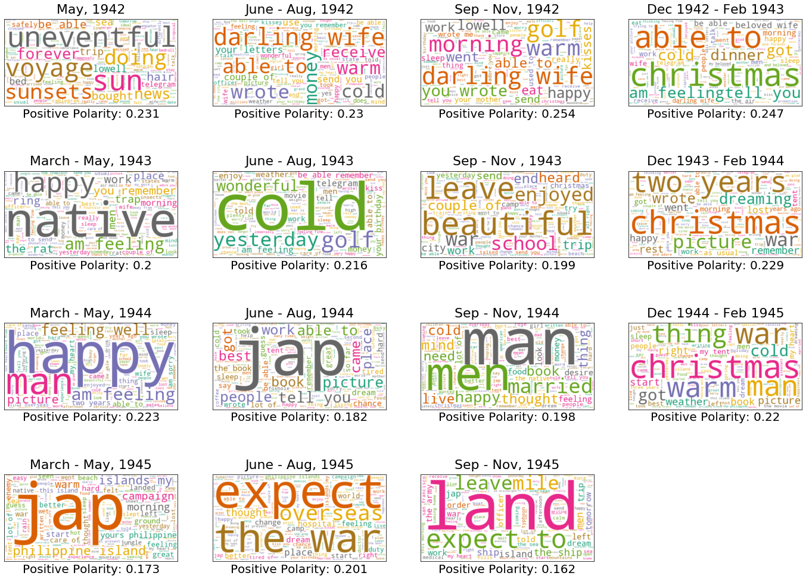
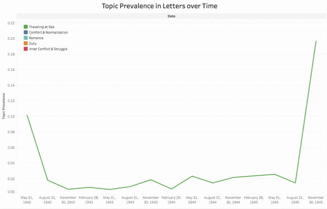

# Analyzing my Grandfather's WWII letters
Ten years ago, my aunt typed all 310 of his letters to help preserve them. I had the great priviledge of using NLP 
to analyze the letters he wrote to my grandmother during his time in the Pacific. 

## Blog
If you would like to read a more fun and in depth discussion of this project, then please check out my blog post on Medium
[here](https://medium.com/@darien.pmt/metis-weeks-6-8-569f9aa752e2).

# The Data
The data for this project was obviously my grandfather's letters. They can be found in `letters_txt` if you'd like to
read some of them.

## Data Cleaning
I had to do some basic cleaning to extract the dates the letters were written as well as the text itself. Once cleaned, 
I put the letters in a Mongo database. The code can be found in `get_data.ipynb`.

# EDA & Sentiment Analysis
A basic EDA was done to remove uninteresting words and to create some nice word clouds. Code can be found in `EDA.ipynb`.
I used vaderSentiment to identify the most positive/negative letters that my grandfather wrote. Code is found in 

## Example word cloud


# Text Preprocessing
Standard NLP preprocessing. Lowercase letters, remove punctuation, lemmatization, tag POS etc. All my count vectorizers and Tf-IDFs 
are constructed here too. Code is found in `preprocessing.ipynb`.

# Topic Modeling
I used several different methods for topic modeling and settled on non-negative matrix factorization. This was the best
most likely because my documents were short. Code can be found in `topic_modeling.ipynb`.

## The Topics
```
Topic  1
war, hospital, expect, medical, overseas, end, news, duty, officer, change

Topic  2
christmas, picture, morning, went, dinner, cold, golf, played, people, warm

Topic  3
union telegram, western union, western union telegram, western, union, tontar, telegram, francisco, san francisco, san

Topic  4
jap, island, native, philippine, rain, philippine island, enemy, campaign, wet, landed

Topic  5
ship, sea, land, typhoon, calm, tonight, kure, morning, bay, island

Topic  6
birthday, wife, beloved, send, happy, beloved wife, kiss, remember, feeling, able
```
## Topic Prevalence over time


# Conclusion
This project was so much fun and I feel very lucky that I had the opportunity to complete it. The best part was reading
the letters again, gaining a fresh perspective on them and getting to know my grandfather better. A special thanks to my
Aunt, Silvia Tontar, for typing the letters.
